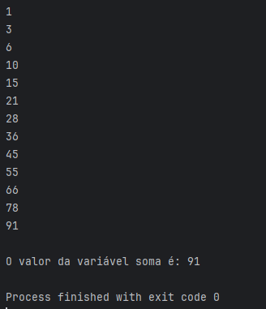
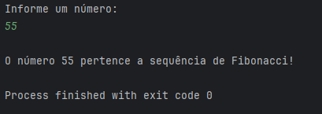
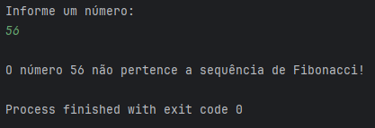
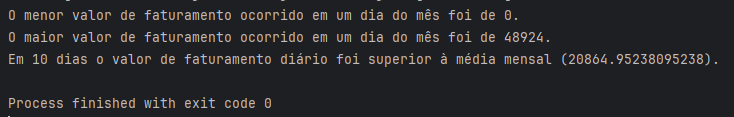
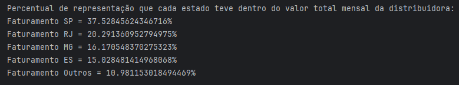
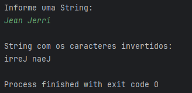

# 💻 Desafio Técnico - Lógica de Programação


Este repositório contém a resolução de um desafio técnico focado em lógica de programação, manipulação de dados (JSON) e algoritmos. O projeto foi desenvolvido em **Java** e demonstra minha capacidade de resolver problemas clássicos de software de forma eficiente.

## 📁 Estrutura do Projeto

O código-fonte das soluções pode ser encontrado no diretório `src/main/java/` e as evidências de execução (prints) estão na pasta `Evidencias/`.

---

## 🚀 Desafios Resolvidos

### 1️⃣ Questão 01: Soma de um laço de repetição
**Enunciado:** Observe o trecho de código abaixo: 
`int INDICE = 13, SOMA = 0, K = 0; Enquanto K < INDICE faça { K = K + 1; SOMA = SOMA + K; } Imprimir(SOMA);` 
Ao final do processamento, qual será o valor da variável SOMA?

- 📄 **Solução:** [Questao1.java](./src/main/java/Questao1.java)
- 🖼️ **Evidência:**<br>
  

### 2️⃣ Questão 02: Sequência de Fibonacci
**Enunciado:** Dado a sequência de Fibonacci, onde se inicia por 0 e 1 e o próximo valor sempre será a soma dos 2 valores anteriores (exemplo: 0, 1, 1, 2, 3, 5, 8, 13, 21, 34...), escreva um programa onde, informado um número, ele calcule a sequência de Fibonacci e retorne uma mensagem avisando se o número informado pertence ou não a sequência.

- 📄 **Solução:** [Questao2.java](./src/main/java/Questao2.java)
- 🖼️ **Evidências:**<br>
  **Caso positivo:**<br>
  <br><br>
  **Caso negativo:**<br>
  

### 3️⃣ Questão 03: Análise de Faturamento Diário
**Enunciado:** Dado um vetor (em formato JSON) que guarda o valor de faturamento diário de uma distribuidora, faça um programa que calcule e retorne:
1. O menor valor de faturamento ocorrido em um dia do mês;
2. O maior valor de faturamento ocorrido em um dia do mês;
3. Número de dias no mês em que o valor de faturamento diário foi superior à média mensal.

*Nota: Dias sem faturamento (como finais de semana e feriados) foram ignorados no cálculo da média, conforme o escopo lógico da solução.*

- 📄 **Solução:** [Pacote Questao3](./src/main/java/Questao3/)
- 🗄️ **Base de Dados:** [dados.json](./dados.json)
- 🖼️ **Evidência:**<br>
  

### 4️⃣ Questão 04: Percentual de Faturamento por Estado
**Enunciado:** Dado o valor de faturamento mensal de uma distribuidora, detalhado por estado:
- SP – R$67.836,43
- RJ – R$36.678,66
- MG – R$29.229,88
- ES – R$27.165,48
- Outros – R$19.849,53

Escreva um programa que calcule o percentual de representação que cada estado teve dentro do valor total mensal da distribuidora.

- 📄 **Solução:** [Pacote Questao4](./src/main/java/Questao4/)
- 🖼️ **Evidência:**<br>
  

### 5️⃣ Questão 05: Inversão de String
**Enunciado:** Escreva um programa que inverta os caracteres de uma string.
*Regra: A inversão deve ser feita manualmente, evitando o uso de funções prontas das linguagens como, por exemplo, o método `reverse`.*

- 📄 **Solução:** [Questao5.java](./src/main/java/Questao5.java)
- 🖼️ **Evidência:**<br>
  

---

## 🛠️ Como Executar

1. Certifique-se de ter o **Java JDK 17+** e o **Maven** instalados na sua máquina.
2. Clone este repositório.
3. Instale as dependências (necessário para a Questão 3) executando na raiz do projeto:
   ```bash
   mvn clean install
   ```
4. Execute as classes principais (`main`) de cada questão através da sua IDE preferida (IntelliJ IDEA, Eclipse, VS Code) ou via terminal.