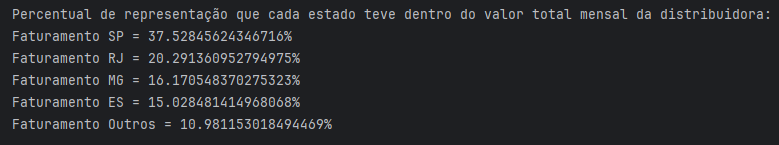
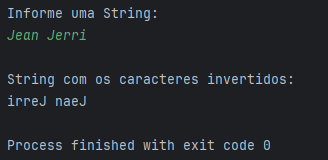

# EVIDÊNCIAS

## Questão 01
[Código](./src/main/java/Questao1.java)

## Questão 02
[Código](./src/main/java/Questao2.java)

## Questão 03
[Código](./src/main/java/Questao3/)

[Dependência](./pom.xml)

[Arquivo de dados](./dados.json)

## Questão 04
[Código](./src/main/java/Questao4/)

## Questão 05
[Código](./src/main/java/Questao5.java)

